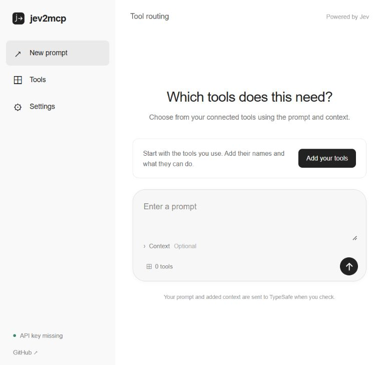

# jev2mcp

A small intelligence layer that helps LLMs choose tools from context.

Built for people who work with MCP servers, plugins, and multiple tool sets. Jev reads the prompt, optional context, and your enabled tool descriptions. Code uses its probabilities to select tools, leave the prompt alone, or hold it for review.



[Watch the 30-second live ChatGPT demo](https://github.com/n8mirai/jev2mcp/releases/download/v0.2.1/jev2mcp-live-demo.mp4).

[Read the Pantry + Instacart live demo protocol](docs/pantry-demo.md).

## Current implementation

- **ChatGPT browser extension:** checks a prompt before Send, selects matching entries in the native `@` picker, then resumes sending.
- **Local companion:** inspect selections and probabilities, configure tools, and copy a prompt for ChatGPT desktop.
- **Routing module:** one TypeSafe request for the overall decision and each enabled tool. No generated tool names or rewritten prompts.

The starter catalog includes Pantry for recorded food inventory and Instacart for building a grocery cart. A request to check what is on hand and cart only missing staples can select both. jev2mcp selects the tools; ChatGPT carries out the inventory lookup and cart action after the native mentions are attached.

Experimental. Verified in signed-in ChatGPT Chat: Jev selected Google Drive, the extension attached its native mention, and ChatGPT retrieved a real demo document. ChatGPT Work remains unverified. Desktop support is a manual handoff. The tool catalog is configured by you; it does not discover your account's installed tools or connect directly to MCP servers.

## Run

Requires Node.js 22.13+ and a [TypeSafe API key](https://console.typesafe.ai/keys). No production npm dependencies.

```sh
git clone https://github.com/n8mirai/jev2mcp.git
cd jev2mcp
# Set TYPESAFE_API_KEY through your environment or secret manager.
npm start
```

Open `http://127.0.0.1:4328`. On macOS, **Run jev2mcp.command** uses the TypeSafe skill's Keychain helper when available, or prompts for a key for the current process. TypeSafe usage is billed separately from ChatGPT.

In **Tools**, enable only tools available to you. Add MCP servers, plugins, or tools using their exact ChatGPT picker names and a short description of what they do.
Existing companion tool settings gain new starter entries without resetting your enabled choices or custom tools. Check that Pantry and Instacart are enabled before pairing the extension again.

For an indirect routing test, try:

> ugh 6am shifts all week. egg sandwiches would save me but do we even have eggs? bread? i swear i saw coffee somewhere and last time i came home with rice we already had. can you sort the morning situation out and tee up whatever is actually missing so i can check it before paying? pls do not place an order.

The expected tool selection is **Pantry + Instacart**. This new prompt must be checked in a live run before that outcome is claimed. The exact groceries depend on the inventory and store catalog; Jev does not decide quantities or place an order.

## Connect ChatGPT

1. Start the local companion.
2. In Chrome's extension settings, load `extension/` as an unpacked extension. This requires developer extensions to be allowed by your browser administrator.
3. Choose **Settings → Copy pairing package** in the companion.
4. Paste it into the jev2mcp extension's **Connection → Pairing package** field and select **Pair & enable**.
5. Reload ChatGPT, type a prompt, and send it.

Context from the last four visible messages is optional and off by default. Re-pair after restarting the bridge or changing your tool catalog.

For desktop, copy the companion's output and select the suggested entries in ChatGPT's `@` picker. Pasted `@` text alone does not activate a tool.

## Behavior

| Jev decision                      | Result                                        |
| --------------------------------- | --------------------------------------------- |
| No tools needed                   | Send the original prompt                      |
| Clear tool matches                | Attach the matching picker entries, then send |
| Uncertain, unavailable, or failed | Keep the draft for review                     |
| Draft edited during the check     | Discard the result                            |

The thresholds are experimental: ≤0.20 for no and ≥0.80 for yes. See the [routing contract](docs/design.md) for details.

Prompts and optional context are sent to TypeSafe. The API key stays in the local bridge; prompts are not logged. [Data and security](SECURITY.md).

## Development

```sh
npm ci
npm test       # deterministic routing, composer, and bridge tests
npm run eval   # synthetic live cases; requires a running bridge
```

`http://127.0.0.1:4328/fixture` runs the production content script against an explicitly labeled local test composer. It is not ChatGPT.

The [recorded evaluation](artifacts/live-evaluation.json) covers ten synthetic cases with the earlier, explicit Pantry request. It does not establish the outcome for the indirect prompt above. This is a smoke check, not an accuracy estimate. A [CI template](docs/ci-example.yml) is included; GitHub Actions is not enabled.

The [live recording notes](docs/demo.md) document the ChatGPT check and video edits. The deterministic suite has 21 tests, including the current roleless plugin picker and native mention resolution.

```text
src/         Routing module, loopback bridge, starter catalog
extension/   ChatGPT adapter and pairing settings
public/      Companion and test composer
test/        Deterministic tests
scripts/     Live evaluation
```

[TypeSafe System One](https://docs.typesafe.ai/) · [Noul primitive](https://docs.typesafe.ai/primitives/noul) · [MIT](LICENSE)

Independent project. Not affiliated with OpenAI or TypeSafe.
